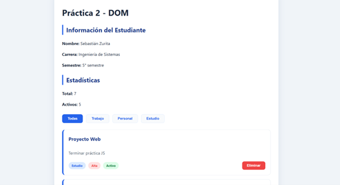
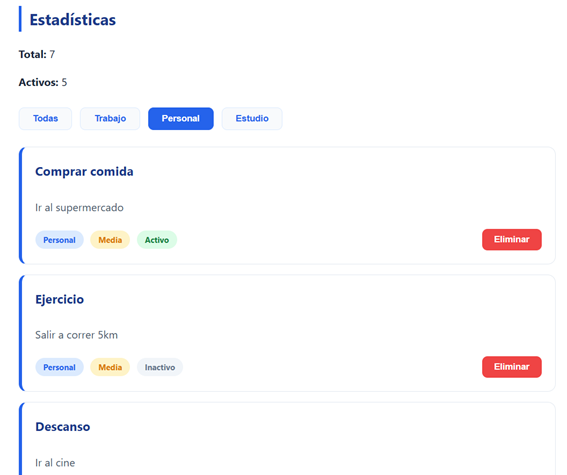

# Práctica 2

# Sebastián Zurita

## 1. Descripción de la Solución
Esta aplicación es un gestor de tareas dinámico que permite visualizar, filtrar y eliminar actividades en tiempo real. La solución se enfoca en el manejo eficiente del **DOM** utilizando un enfoque híbrido: creación de elementos con `createElement` para mayor seguridad y plantillas de texto (`template literals`) para la estructura interna.

## 2. Fragmentos de Código Relevantes

### 2.1 Renderizado de la Lista
Se utiliza una función que limpia el contenedor y recorre el array de objetos para crear la estructura HTML de cada tarjeta.

```javascript
function renderizarLista(datos) {
    const contenedor = document.getElementById('contenedor-lista');
    contenedor.innerHTML = ''; 
    
    datos.forEach(el => {
        const card = document.createElement('div');
        card.className = 'card';
        card.innerHTML = `
            <h3>${el.titulo}</h3>
            <p>${el.descripcion}</p>
            <div class="card-footer">
                <div class="badges">
                    <span class="badge badge-categoria">${el.categoria}</span>
                    <span class="badge prioridad-${el.prioridad.toLowerCase()}">${el.prioridad}</span>
                    <span class="badge estado-${el.activo ? 'activo' : 'inactivo'}">${el.activo ? 'Activo' : 'Inactivo'}</span>
                </div>
                <button class="btn-eliminar" onclick="eliminarElemento(${el.id})">Eliminar</button>
            </div>
        `;
        contenedor.appendChild(card);
    });
    actualizarEstadisticas();
}

```  

### 2.2 Eliminación de Elementos
Se filtra el array principal comparando los IDs y se dispara un nuevo renderizado de la interfaz.

```  JavaScript
function eliminarElemento(id) {
    elementos = elementos.filter(el => el.id !== id);
    renderizarLista(elementos);
}

```  

### 2.3 Filtrado dinámico
Se capturan los eventos de click en los botones de filtro para mostrar solo los elementos que coincidan con la categoría seleccionada.

```  JavaScript
if (categoria === 'todas') {
    renderizarLista(elementos);
} else {
    const filtrados = elementos.filter(e => e.categoria === categoria);
    renderizarLista(filtrados);
}
```  
## 3. Estilos Importantes

### 3.1 Layout con Flexbox
Para el listado de tareas se utiliza un contenedor flexible que organiza las tarjetas en una columna vertical.

```  CSS
#contenedor-lista {
    display: flex;
    flex-direction: column;
    gap: 15px;
}
```  

### 3.2 Hover effects
Tanto las tarjetas como los botones cuentan con transiciones para mejorar la experiencia de usuario. Al pasar el cursor, los elementos aumentan ligeramente su escala o cambian de color.

```  CSS
.card:hover {
    transform: scale(1.01);
    border-color: var(--primary-main);
}

.btn-filtro:hover {
    background: var(--primary-light);
}
```  

### 3.3 Botón de eliminar con color rojo
Se utiliza una variable de color de peligro para identificar visualmente la acción de borrado.

```  CSS
.btn-eliminar {
    background-color: var(--danger);
    color: white;
    border: none;
    padding: 8px 18px;
    border-radius: 8px;
    cursor: pointer;
    font-weight: bold;
}
```  

### 3.4 Filtros activos resaltados
El filtro seleccionado cambia su fondo a un azul sólido y el texto a blanco para indicar la sección activa.

```  CSS
.btn-filtro-activo {
    background-color: var(--primary-main) !important;
    color: white !important;
    border-color: var(--primary-main);
}

```  

## 4. Imágenes 

### 4.1 Vista general de la Aplicación 



### 4.2 Filtro Aplicado



