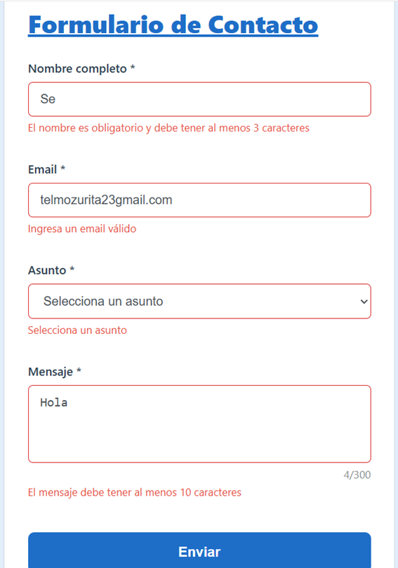
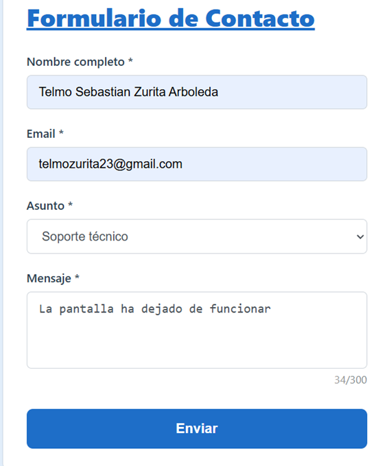
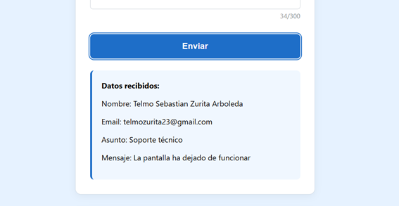
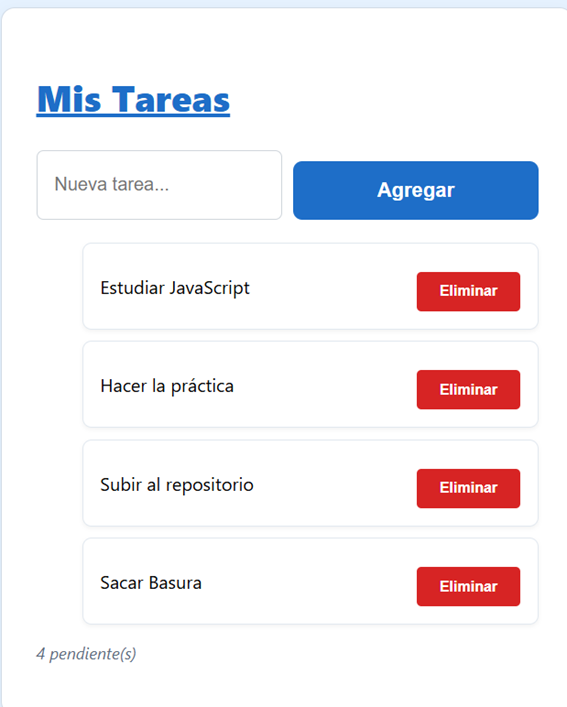
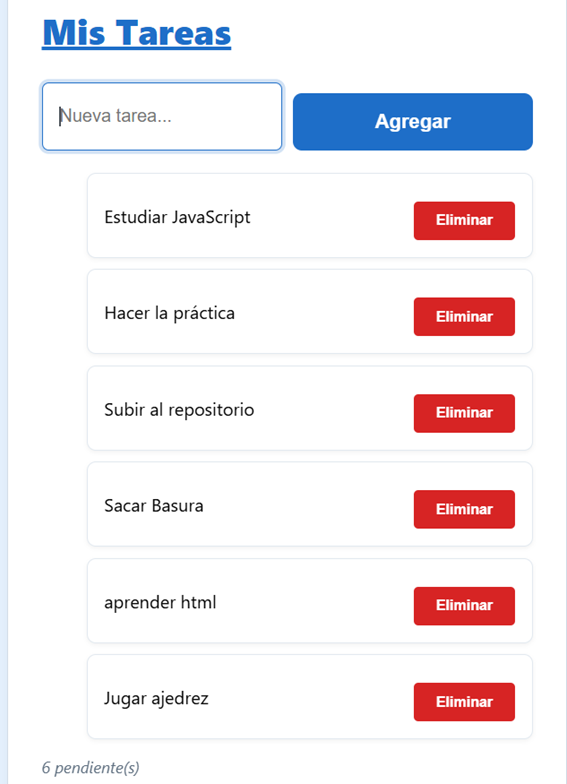
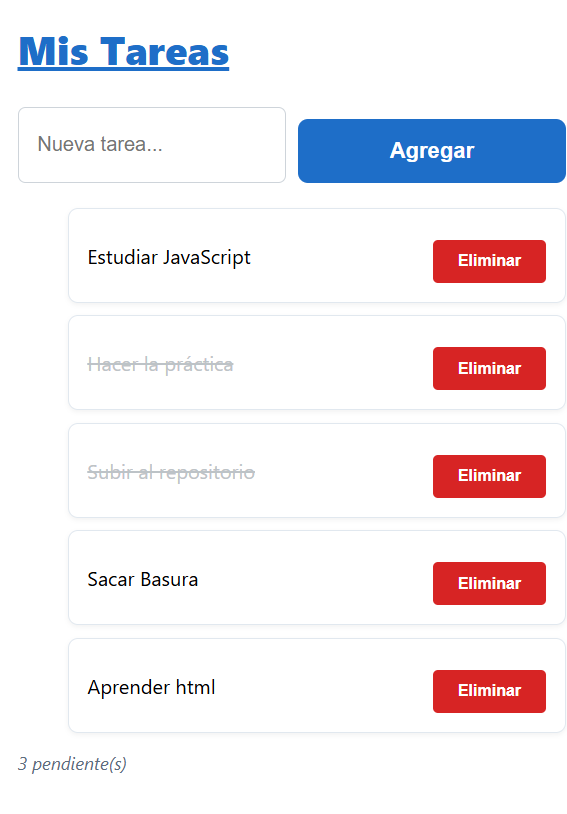

# Práctica 3

# Sebastián Zurita


## 1. Descripción de la Solución

Se implementó una interfaz web interactiva que combina un **formulario de contacto con validaciones avanzadas** y un **gestor de tareas (To-Do List)**. La solución utiliza JavaScript moderno para manipular el DOM de forma eficiente, asegurando una experiencia de usuario fluida y una lógica de datos robusta.

## 2. Fragmentos de Código Destacados

### 2.1 Validación de Formulario con `preventDefault()`


Para evitar que la página se recargue y poder procesar los datos localmente, se intercepta el evento de envío.
En el evento `submit`, utilizamos `e.preventDefault()` para validar todos los campos antes de permitir el procesamiento de los datos.
```javascript
formulario.addEventListener('submit', (e) => {
    e.preventDefault(); // Detiene el envío del formulario

    // Validación masiva mediante nuestras funciones específicas
    const nombreValido = validarNombre();
    const emailValido = validarEmail();
    const asuntoValido = validarAsunto();
    const mensajeValido = validarMensaje();

    if (nombreValido && emailValido && asuntoValido && mensajeValido) {
        mostrarResultado(); // Muestra el resumen de datos si todo es correcto
        formulario.reset();
    }
});
```

### 2.2 Event Delegation en la Lista de Tareas
En lugar de asignar un evento a cada botón de eliminar, usamos la delegación de eventos para mejorar el rendimiento.
```javascript
listaTareas.addEventListener('click', (e) => {
    const action = e.target.dataset.action;
    const item = e.target.closest('li');
    const id = Number(item.dataset.id);

    if (action === 'eliminar') {
        tareas = tareas.filter((tarea) => tarea.id !== id);
        renderizarTareas();
    } else if (action === 'toggle') {
        const tarea = tareas.find((itemTarea) => itemTarea.id === id);
        if (tarea) {
            tarea.completada = !tarea.completada;
            renderizarTareas();
        }
    }
});
```

### 2.3 Atajo de Teclado (Ctrl + Enter)
Se añadió accesibilidad mediante un listener global que permite enviar el formulario rápidamente.
```javascript
document.addEventListener('keydown', (e) => {
    if (e.ctrlKey && e.key === 'Enter') {
        e.preventDefault();
        // Dispara la lógica de validación del formulario
        formulario.requestSubmit(); 
    }
});
```

## 3. Capturas de Pantalla

### 3.1 Validación en Acción
Muestra cómo los mensajes de error aparecen dinámicamente cuando los campos no cumplen los requisitos.


### 3.2 Formulario Procesado
Resultado visual después de enviar correctamente los datos, mostrando el cuadro de resumen azul.


# Muestra exitosa



### 3.3 Event Delegation 
La lista de tareas funcionando, incluyendo si se pueden agregar o elminar


### 3.4 Contador Actualizado
La lista de tareas funcionando con el contador de pendientes actualizado en tiempo real



### 3.5 Tareas Completadas
Demostración del estilo visual (tachado) cuando una tarea se marca como finalizada.
