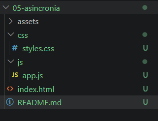
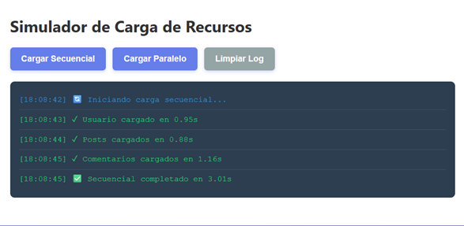
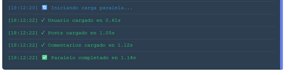
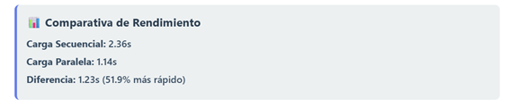
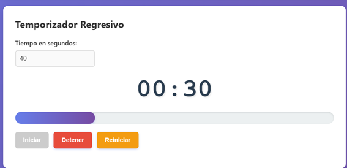
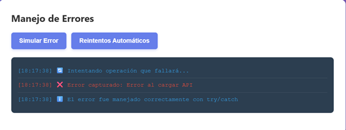
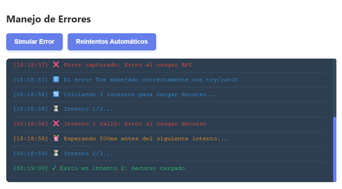

# PRACTICA 5

## Sebastián Zurita

## 1. Descripción del simulador
Este proyecto consiste en un sistema interactivo diseñado para demostrar y analizar el comportamiento de las operaciones asíncronas en JavaScript. El simulador se divide en tres módulos principales:

* **Comparador de Peticiones:** Permite contrastar el rendimiento de la carga secuencial frente a la paralela, calculando el ahorro de tiempo real entre ambos métodos.
* **Temporizador Dinámico:** Un cronómetro funcional que gestiona intervalos de tiempo, actualiza una barra de progreso en el DOM y activa alertas visuales cuando el tiempo es crítico (menos de 10 segundos).
* **Gestión de Resiliencia:** Un módulo especializado en el manejo de excepciones y estrategias de recuperación, implementando reintentos automáticos con espera exponencial para asegurar la continuidad del sistema ante fallos.


## 2. Código destacado

### 2.1 Función que retorna promesa con `setTimeout`
Esta función es el núcleo de la simulación, replicando la latencia de un servidor real y permitiendo forzar errores controlados.
```javascript
function simularPeticion(nombre, tiempoMin = 500, tiempoMax = 2000, fallar = false) {
    return new Promise((resolve, reject) => {
        const tiempoDelay = Math.floor(Math.random() * (tiempoMax - tiempoMin + 1)) + tiempoMin;
        setTimeout(() => {
            if (fallar) {
                reject(new Error(`Error al cargar ${nombre}`));
            } else {
                resolve({ nombre, tiempo: tiempoDelay });
            }
        }, tiempoDelay);
    });
}

```

### 2.2 Carga secuencial con await consecutivos
Aquí se observa cómo el flujo se detiene en cada línea, ejecutando las tareas una tras otra.

```java
const usuario = await simularPeticion('Usuario', 500, 1000);
const posts = await simularPeticion('Posts', 700, 1500);
const comentarios = await simularPeticion('Comentarios', 600, 1200);

```

### 2.3 Carga paralela con Promise.all
A diferencia del anterior, este método dispara todas las promesas al mismo tiempo, optimizando la ejecución.

```javascript
const promesas = [
    simularPeticion('Usuario', 500, 1000),
    simularPeticion('Posts', 700, 1500),
    simularPeticion('Comentarios', 600, 1200)
];
const resultadosPromesas = await Promise.all(promesas);
```

### 2.4 Manejo de errores con try/catch
Se utiliza para capturar fallos en operaciones asíncronas, evitando que la aplicación se bloquee.

```JavaScript
try {
    await simularPeticion('API', 500, 1000, true);
} catch (error) {
    mostrarLogError(`❌ Error capturado: ${error.message}`, 'error');
}
```

### 2.5 Temporizador con setInterval
Controla la cuenta regresiva actualizando la interfaz cada segundo.


```JavaScript
intervaloId = setInterval(() => {
    tiempoRestante--;
    actualizarDisplay();
    if (tiempoRestante <= 0) {
        detener();
        alert('⏰ ¡Tiempo terminado!');
    }
}, 1000);
```

## 3. Capturas

### 3.1 Estructura del proyecto



### 3.2 Carga Secuencial


### 3.3 Carga Paralela


### 3.4 Comparativa de tiempos


Este contenedor muestra la comparación de ambas funciones.

### 3.5 Temporizador funcionando

Temporizador funcionando y con barra de progreso.


Una vez terminado el temporizador, se muestra un mensaje que ha finalizado.

### 3.6 Manejo de errores 



Aqui se muestra los errores capturados 



Sistema de reinicio automático, hace que el sistema intente recuperar una operación fallida sin que el usuario tenga que intervenir manualmente.


Aqui se evidencia que en la consola tampoco existe ningún error


## 4. Análisis: Carga Secuencial vs. Paralela

Tras ejecutar las pruebas de rendimiento en el simulador, se obtuvieron las siguientes métricas comparativas:

| Métrica | Resultado |
| :--- | :--- |
|  **Tiempo Secuencial** | `3.01 segundos` |
|  **Tiempo Paralelo** | `1.14 segundos` |
|  **Diferencia (Ahorro)** | **1.87 segundos** |
|  **Incremento de Eficiencia** | **62.1% más rápido** |

---

###  Conclusión Técnica

La diferencia fundamental radica en la **gestión estratégica de la latencia** dentro del entorno de ejecución de JavaScript:

* **Modelo Secuencial:** El tiempo total es estrictamente acumulativo. El flujo se bloquea en cada línea, resultando en una suma lineal de tiempos: 
    $$T_{total} = T_1 + T_2 + T_3$$
* **Modelo Paralelo (`Promise.all`):** Las peticiones se disparan de forma concurrente. El tiempo de espera ya no es la suma, sino que queda definido por la tarea que presenta la mayor latencia: 
    $$T_{total} = \max(T_1, T_2, T_3)$$

> **Conclusión:** Implementar procesos paralelos es una optimización crítica. No solo mejora el rendimiento técnico, sino que reduce drásticamente la latencia percibida, transformando positivamente la experiencia del usuario (UX).