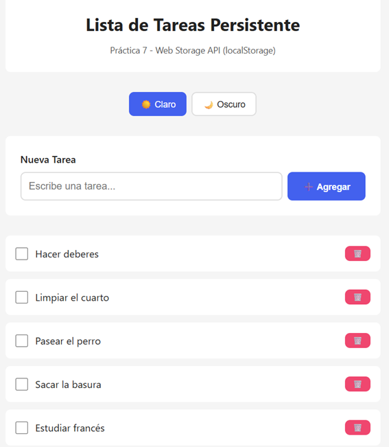
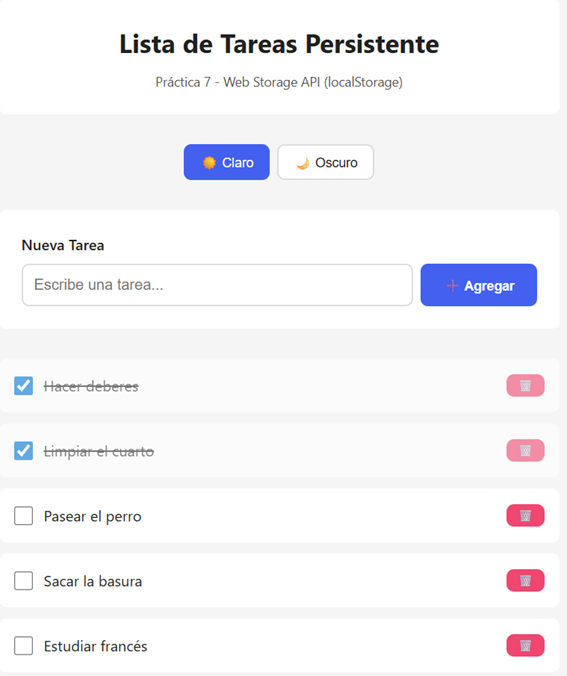
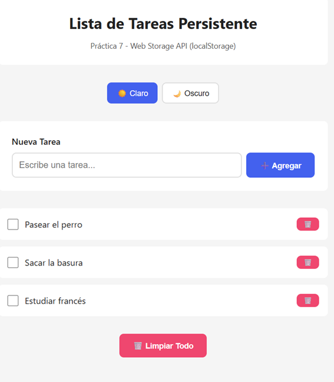
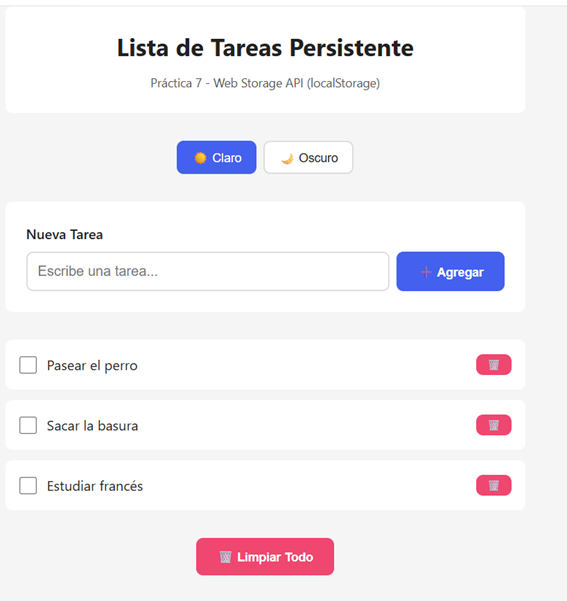
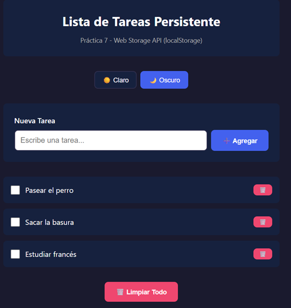
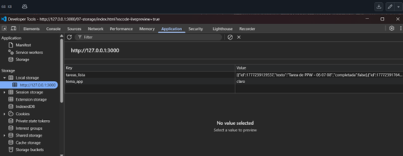
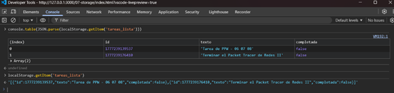
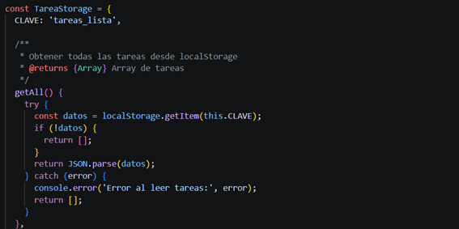

# PRACTICA 5

## Sebastián Zurita

## 1. Descripción de la aplicación

Esta aplicación está diseñada para organizar actividades diarias, permitiendo al usuario gestionar tareas de forma sencilla e interactiva. Su característica principal es la persistencia de datos, lo que garantiza que la información no se pierda al cerrar o recargar el navegador.

Esto se logra mediante el uso de LocalStorage, donde el arreglo de tareas en JavaScript se convierte a formato JSON utilizando JSON.stringify() y se almacena físicamente en el navegador. Posteriormente, cuando la aplicación se recarga, los datos son recuperados con JSON.parse(), reconstruyendo el estado original.

Además, la interfaz incorpora un sistema de personalización visual mediante dos temas (claro y oscuro), permitiendo al usuario elegir la apariencia de la aplicación según su preferencia.

## 2. Capturas de la aplicación
### 2.1 Lista con datos - Items creados y visibles

Descripción:
Se agregan tareas mediante el formulario y estas se renderizan inmediatamente en la lista inferior, mostrando su estado (pendiente o completada).

### 2.2 Persistencia - Recargar página

Descripción:
Al presionar F5, las tareas permanecen en la lista gracias al LocalStorage. Se valida además el cambio de estado al marcar una tarea como completada.

### 2.3 Eliminación de tareas

Descripción:
Se elimina una tarea utilizando el botón correspondiente. El sistema muestra un mensaje temporal confirmando la acción realizada.

### 2.4 Temas de la aplicación
Tema claro

Descripción:
Es el tema por defecto al iniciar la aplicación. Presenta colores neutros y fondo claro.

Tema oscuro

Descripción:
Al seleccionar el modo oscuro, la interfaz cambia a tonalidades oscuras. Esta preferencia también se guarda en LocalStorage.

### 2.5 DevTools - Local Storage

Descripción:
En la pestaña Application > Local Storage se observan las claves utilizadas:

tareas_lista: contiene el arreglo de tareas en formato JSON
tema_app: guarda el tema seleccionado por el usuario

### 2.6 Exportar / Importar datos

Descripción:
En la consola del navegador se evidencia el uso de:

JSON.parse() para convertir los datos almacenados en objetos JavaScript
console.table() para visualizar de forma estructurada las tareas

Cada objeto contiene:

id
texto
completada

### 2.7 Código - Servicio de Storage

Descripción:
Se implementa un sistema CRUD utilizando la Web Storage API.

Se destacan:

Uso de clave única (tareas_lista)
Conversión de datos con JSON.stringify() y JSON.parse()
Métodos para crear, leer, actualizar y eliminar tareas

## 3. Conclusión

La implementación de **LocalStorage** en esta aplicación demuestra cómo es posible construir sistemas persistentes en el frontend sin depender de un backend.

El uso combinado de:

- Manipulación del DOM  
- Eventos  
- JSON  
- Web Storage API  

permite desarrollar una aplicación completa, interactiva y eficiente.