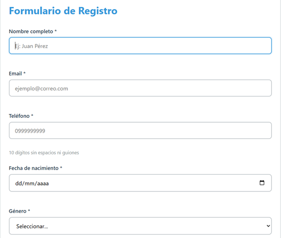
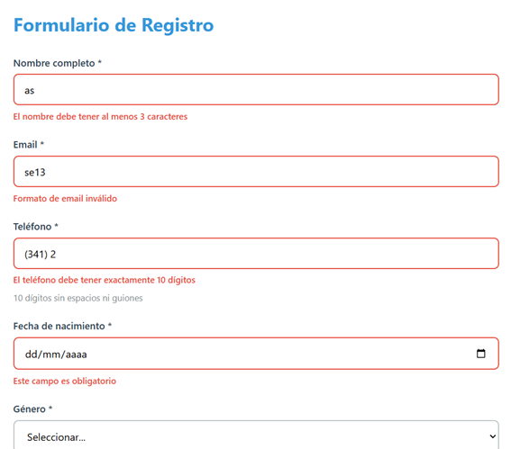
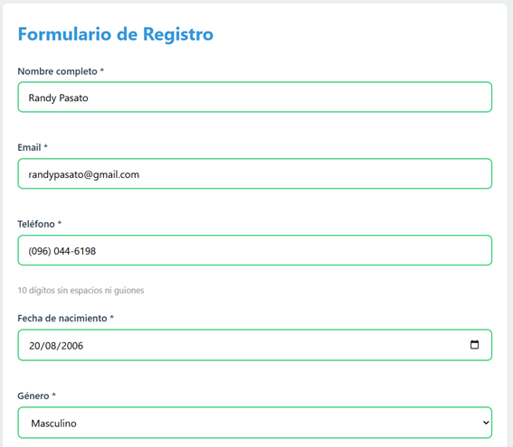
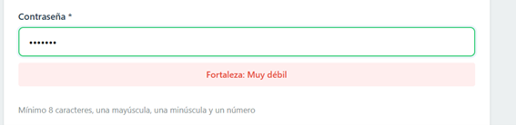
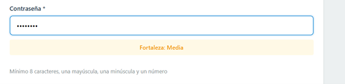
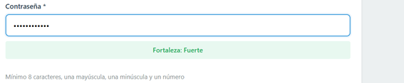
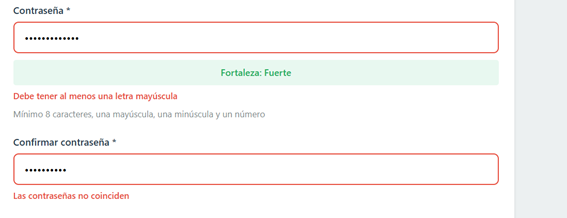
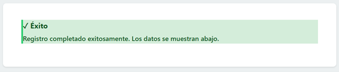
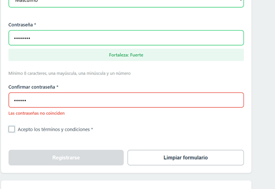
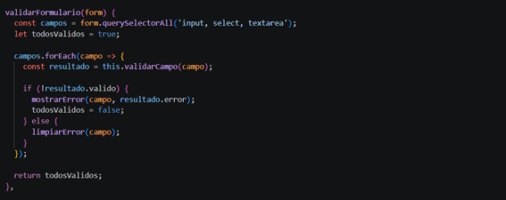

# PRÁCTICA 8  

## Sebastián Zurita  

## 1. Descripción de la aplicación  

La aplicación está diseñada para **ingresar y validar los campos de un formulario de registro**, aplicando diferentes métodos de validación personalizados en JavaScript.  

Se implementa validación en tiempo real, retroalimentación visual al usuario y control del envío del formulario, garantizando que los datos ingresados sean correctos antes de procesarlos.  

---

## 2. Capturas de la aplicación  

### 2.1 Formulario vacío - Vista inicial  
  

**Descripción:**  
Interfaz inicial del formulario con todos los campos vacíos, lista para ser utilizada por el usuario.  

---

### 2.2 Errores de validación  
  

**Descripción:**  
Se ingresan datos incorrectos en los campos para verificar las validaciones.  
Los campos muestran bordes rojos junto con mensajes de error, indicando al usuario qué información debe corregir.  

---

### 2.3 Campos válidos  
  

**Descripción:**  
Al ingresar datos correctos, los campos cambian a color verde y desaparecen los mensajes de error, indicando que la validación fue exitosa.  

---

### 2.4 Fuerza de contraseña  

#### Contraseña débil  
  

**Descripción:**  
Se ingresan pocos caracteres, por lo que la contraseña no cumple los requisitos mínimos. El indicador muestra un nivel bajo (color rojo).  

#### Contraseña media  
  

**Descripción:**  
La contraseña mejora, pero aún no cumple completamente con todos los criterios. El indicador muestra nivel medio (color naranja).  

#### Contraseña fuerte  
  

**Descripción:**  
La contraseña cumple todos los requisitos (longitud, mayúsculas, minúsculas y números). El indicador muestra nivel alto (color verde).  

---

### 2.5 Confirmación de contraseña  
  

**Descripción:**  
Cuando las contraseñas no coinciden, se muestra un mensaje de error y el campo se resalta en rojo.  

---

### 2.6 Envío exitoso  
  

**Descripción:**  
Cuando todos los campos son válidos y se aceptan los términos:  

- Se habilita el botón de registro  
- Se envía el formulario  
- Se muestra un mensaje de éxito  
- Se limpian los campos  
- Los datos se muestran en pantalla o consola  

---

### 2.7 Funcionalidad extra - Botón inteligente  
  

**Descripción:**  
El botón de registro permanece deshabilitado hasta que todos los campos estén completos y validados correctamente.  

Esto mejora la experiencia del usuario (UX) y previene errores.  

Ejemplo de implementación:  

```javascript
function actualizarEstadoBoton() {
    let validado = true;
    const campos = form.querySelectorAll('input[required], select[required]');
    
    campos.forEach(input => {
        if (!input.classList.contains('is-valid')) {
            validado = false;
        }
    });

    btnSubmit.disabled = !validado;

}
```

  

### Métodos de validación adicionales  

En la última parte del objeto `Validacion`, se implementan tres métodos fundamentales para el funcionamiento del formulario:

- **validarFormulario(form):**  
  Recorre todos los campos del formulario y los valida uno por uno.  
  Si alguno presenta error, el formulario completo se considera inválido.  
  Este método es clave para habilitar o deshabilitar el botón de registro.

- **esMayorEdad(fechaStr):**  
  Calcula la edad real del usuario a partir de su fecha de nacimiento y verifica si es mayor o igual a 18 años.  
  Para ello:
  - Obtiene la fecha actual  
  - Convierte la fecha ingresada a tipo `Date`  
  - Calcula la diferencia de años  
  - Ajusta el resultado considerando meses y días (en caso de que aún no haya cumplido años en el año actual)

- **evaluarFuerzaPassword(pass):**  
  Clasifica la contraseña según su nivel de seguridad (débil, media o fuerte).  
  La evaluación se basa en:
  - Longitud de la contraseña  
  - Uso de mayúsculas y minúsculas  
  - Inclusión de números  
  - Uso de caracteres especiales  